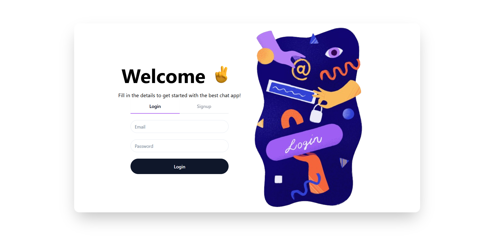
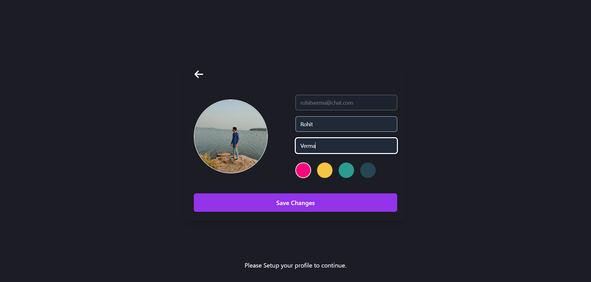
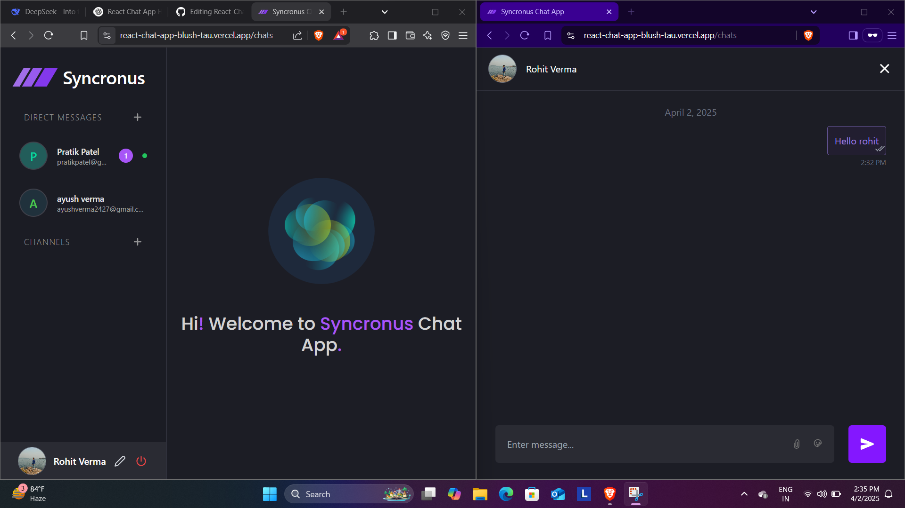

Synchronus – Real-Time Chat App
🚀 Synchronus is a full-stack real-time chat application built with React, Node.js, and Socket.io. It allows users to send and receive messages instantly with <100ms latency, making it perfect for real-time communication.

Features
✅ Real-Time Messaging: Instant message delivery using Socket.io.
✅ User Authentication: Secure login and registration with JWT and Bcrypt.
✅ Role-Based Access Control: Different permissions for users and admins.
✅ Responsive UI: Modern and mobile-friendly design using Tailwind CSS.
✅ Optimized Performance: Achieved 90%+ Lighthouse score with Vite and lazy loading.

Tech Stack
Frontend: React, Tailwind CSS, Context API, ShadCN

Backend: Node.js, Express, Socket.io

Database: MongoDB

Authentication: JWT, Bcrypt

Deployment: Render (Backend), Vercel (Frontend)

Screenshots

1. Login Page

Secure login and registration with JWT authentication.

2. Profile Page

Create and update your profile

3. Chat page UI

Real-time messaging with a clean and intuitive UI.

Live Demo
[Check out the live demo here](https://react-chat-app-blush-tau.vercel.app)

Connect with Me
Let’s connect and collaborate!

[LinkedIn](https://www.linkedin.com/in/r04hitverma/)

[Email](rohitverma272727@gmail.com)
